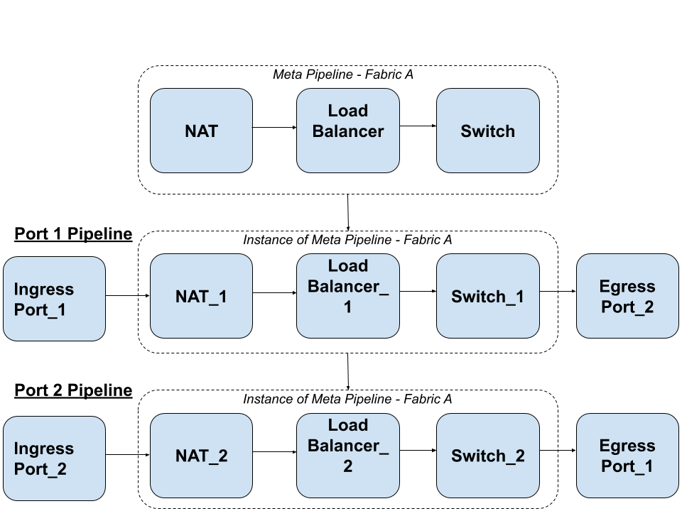
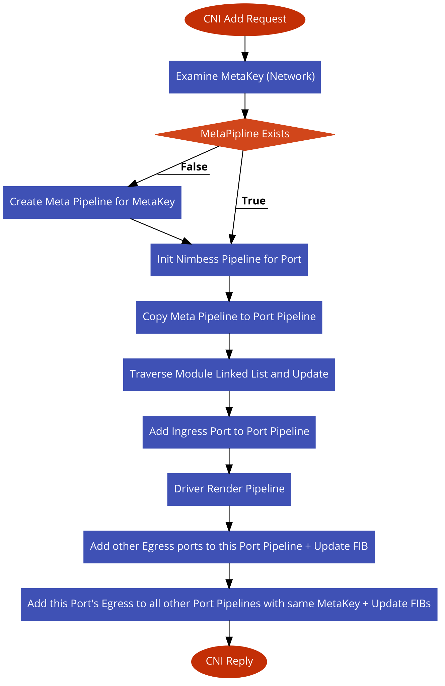

# Nimbess Agent Design

## Overview

Nimbess Agent's main purpose is to manage an external data plane. The Agent's main responsibilities
include:

 1. Translating Northbound (NB) application-specific resources into network oriented resources across the
 entire network fabric.
 2. Managing and serving as the control plane for the locally assigned, and external data plane (Southbound).
 
 The Agent is distributed over every host and each Agent instance is capable of viewing and managing the
 network configuration for the entire fabric. However, only the Agent local to a data plane (on the same host)
 is capable of directly configuring that data plane.
 
## Agent Northbound Design
 
Nimbess Agent is able to support multiple container platforms and by default supports Kubernetes (K8S). It
also supports the CNI spec for handling CNI requests from Kubelet or other container platforms which use
CNI. The Nimbess Agent NB is responsible for translating K8S resources into network-oriented resources.

The Agent exposes a gRPC based CNI API in order to service CNI requests. The requests are translated into
Nimbess Ports, and a Network Pipeline is built for that Port. For other networking related container platform
resources, such as a K8S Service, Ingress, etc; Nimbess Agent will handle translating those resources into their
relevant network-oriented constructs and applied to one or more pipelines.
 
## Network Constructs in Nimbess Agent
 
In Nimbess, how traffic flows through a data plane can be though of as a pipeline of Network Functions.
Traffic ingresses a data plane, flows through a series of network functions such as a Switch, ACL,
Load-Balancer, etc and then egresses the data plane out of a port. Nimbess uses this concept of a Network
Pipeline and creates one for each Port that is attached to the data plane. There are multiple reasons for
this design:
 
 1. Guarantees loop-free forwarding
 2. Increases per network function processing efficiency
 3. Simplifies debugging
 
When a Port is added to a pipeline, it is broken into an IngressPort as well as an EgressPort. Only the
IngressPort is ever attached to a Port's pipeline. This prevents traffic from ever being forwarded back
out the same interface from which it originated (1). The EgressPort is attached to every other port
pipeline which belongs to the same network fabric (L2/L3 domain). Additionally, this design increases network
function processing efficiency, because the cache of the tables are limited to lookups for traffic that may ingress
a single port. Debugging becomes easier because the only traffic in a particular pipeline only ever comes
from a single port. However, one of the drawbacks to this design is that there is increased memory usage,
as the number of instances of network functions scale by the number of ports in the system.

Although each Port contains its own Port Pipeline, the core network functions portion of the pipeline
remain the same for Ports that belong to the same network fabric. Therefore Nimbess abstracts this portion of
the Port Pipelines into what is called a Meta Pipeline. This allows Nimbess to make core updates to only
a single Meta Pipeline, which will then be used to create or update Port Pipelines. Here is an example of
what the pipelines may look like for a single L2 network with 2 Ports:

In the example above, the EgressPort for Port 1 is attached to every other Port Pipeline (in this case only 1)
other than Port 1's Pipeline. The same is true for Port 2. This behavior prevents forwarding packets out the
same interface traffic came in on. Each instance of the Meta Pipeline for the Port Pipeline uses a unique ID
in order to distinguish these functions when they are rendered into different data planes. There may be many
Meta Pipelines which belong to either different L2 networks (i.e. VLANs) or L3 networks (i.e. VRFs). A Port
may only belong to a single Meta Pipeline.

## Southbound Design

Nimbess Agent uses a data plane agnostic southbound. Nimbess defines an abstract Driver type which any
data plane driver may implement. The driver is configured in the Nimbess Agent config file and loaded at
run time. A data plane driver is responsible for taking in Port Pipeline objects translating them into driver
specific configuration, and then updating the Port Pipeline Modules with any related network configuration.
This returned network configuration may vary per module, but as an example, updating a new Port object with
the MAC address returned from the data plane when the Port is created.

## Example Code Flow - CNI ADD Request

Below is an example of walking through the pseudo code of a CNI ADD request:

A Nimbess Pipeline structure is used to hold all of the information needed to define a network pipeline. It includes
information such as an array of all modules in the pipeline, the MetaKey for this pipeline, which port this
pipeline belongs to, etc. While the pipeline holds the information describing which modules belong to the
pipeline, it does not indicate module connectivity. Connectivity information is conveyed by the module itself,
via Ingress and Egress Port Maps which contain a map of the gate number and a pointer to the next module this module is
connected to, creating a multi-dimensional linked list. Therefore when a new Port Pipeline is created, it is necessary
to make a copy of the Meta Pipeline, including a list of the Meta Modules used to instantiate a new Port Pipeline
module list. However after creating the new Module list, all of the connectivity needs to be updated to point to the
new instances of modules held within the Gate Maps. This is done via the above block which describes traversing the
module linked list and updating it.

After the new Port Pipeline is created, Ingress Port is created and attached to the Port Pipeline, and then rendered
into the data plane via a driver call. Upon success of programming the data plane with the initial pipeline
a lookup is performed to find other already existing Egress Ports which belong to this same network (MetaKey). If any
applicable ports exist they are then added to the new Port Pipeline and the FIB (L2 or L3) is updated to handle traffic
that should be destined out this port. Afterwards, the Egress Port that resulted from the CNI request is added to all
other Port Pipelines which also belong to the network domain, and their FIBs are updated.
